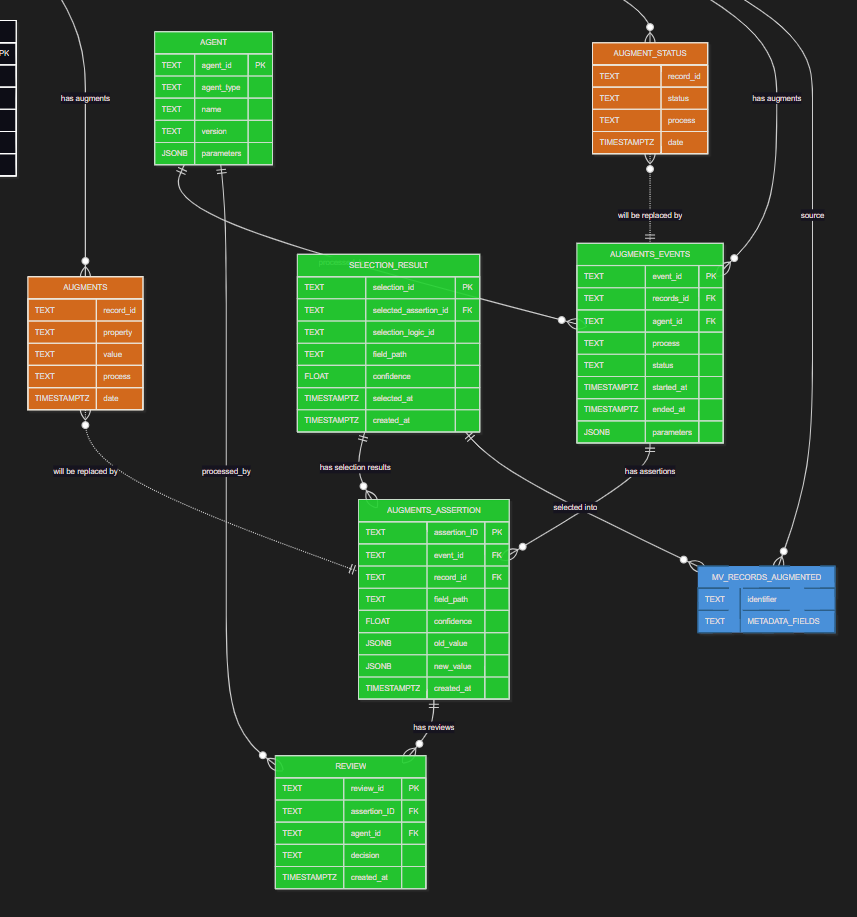

# SoilWise-HE - Metadata augmentation

Incidentally metadata records are marginally populated. This component aims to enrich poor metadata records from their context.
The processes runs at intervals on newly acquired records.

## Relational Data Model

```mermaid
erDiagram

    classDef augmentation fill:#d2691e,stroke:#ebe4d8,stroke-width:2px
    classDef augmentation_4_0 fill:#1ed22de8,stroke:#c9ddcbe8,stroke-width:2px
    classDef matview fill:#4a90d9,stroke:#2c5f8a,stroke-width:2px,stroke-dasharray:5 5

    RECORDS {
        TEXT identifier PK
        TEXT source PK
        TEXT md_lang
        TIMESTAMP md_date
        TIMESTAMP harvest_date
        TEXT title
        TEXT abstract
        TEXT language
        TEXT edition
        TEXT format
        TEXT type
        TIMESTAMP revisiondate
        TIMESTAMP creationdate
        TIMESTAMP publicationdate
        TIMESTAMP embargodate
        TEXT resolution
        TEXT denominator
        TEXT accessconstraints
        TEXT license
        TEXT rights
        TEXT lineage
        TEXT spatial
        TEXT spatial_desc
        TEXT datamodel
        TIMESTAMP temporal_start
        TIMESTAMP temporal_end
        TEXT thumbnail
        TEXT md5_hash UK
        TEXT raw_mcf
    }

    RECORDS_FAILED {
        TEXT identifier
        TEXT hash PK
        TEXT error
        TIMESTAMP date
    }

    RECORDS_PROCESSED {
        TEXT identifier
        TEXT hash PK
        TEXT source
        TEXT final_id
        TEXT mode
        TIMESTAMP date
    }

    PERSON {
        INT id PK
        TEXT name
        TEXT alias
        TEXT email
        TEXT orcid
    }

    ORGANIZATION {
        INT id PK
        TEXT name
        TEXT alias
        TEXT phone
        TEXT ror
        TEXT address
        TEXT postalcode
        TEXT city
        TEXT administrativearea
        TEXT country
        TEXT url
    }

    CONTACT_IN_RECORD {
        INT id PK
        INT fk_organization FK
        INT fk_person FK
        TEXT record_id
        TEXT role
        TEXT position
    }

    SUBJECTS {
        INT id PK
        TEXT uri
        TEXT label
        TEXT thesaurus_name
        TEXT thesaurus_url
    }

    RECORD_SUBJECT {
        INT id PK
        TEXT record_id
        INT subject_id FK
    }

    ATTRIBUTES {
        INT id PK
        TEXT record_id
        TEXT name
        TEXT title
        TEXT url
        TEXT units
        TEXT type
    }

    RELATIONS {
        INT id PK
        TEXT record_id
        TEXT identifier
        TEXT scheme
        TEXT type
    }

    SOURCES {
        TEXT name PK
        TEXT description
    }

    RECORD_SOURCES {
        TEXT record_id PK
        TEXT fk_source PK,FK
    }

    RECORD_IN_PROJECT {
        INT id PK
        TEXT record_id UK
        TEXT project
    }

    ALTERNATE_IDENTIFIERS {
        TEXT record_id PK
        TEXT alt_identifier PK
        TEXT scheme
    }

    DISTRIBUTIONS {
        INT id PK
        TEXT record_id
        TEXT name
        TEXT format
        TEXT url
        TEXT description
    }

    AUGMENTS {
        TEXT record_id
        TEXT property
        TEXT value
        TEXT process
        TIMESTAMPTZ date
    }

    AUGMENT_STATUS {
        TEXT record_id
        TEXT status
        TEXT process
        TIMESTAMPTZ date
    }

    EMPLOYMENT {
        INT person_id PK,FK
        INT organization_id PK,FK
        TEXT role
        TIMESTAMP start_date
        TIMESTAMP end_date
        TEXT source
        TIMESTAMP date
    }

    %% new tables
    AUGMENTS_EVENTS {
        TEXT event_id PK
        TEXT records_id FK
        TEXT agent_id FK

        TEXT process
        TEXT status
        TIMESTAMPTZ started_at
        TIMESTAMPTZ ended_at

        JSONB parameters

    }

    AGENT{
        TEXT agent_id PK
        TEXT agent_type
        TEXT name
        TEXT version
        JSONB parameters
    }

    %% types for old_value and new_value. Maybe miscalenious?
    AUGMENTS_ASSERTION {
        TEXT assertion_ID PK
        TEXT event_id FK
        TEXT record_id FK

        TEXT field_path
        FLOAT confidence
        
        JSONB old_value
        JSONB new_value
        TIMESTAMPTZ created_at
    }

    REVIEW {
        TEXT review_id PK
        TEXT assertion_ID FK
        TEXT agent_id FK

        TEXT decision
        TIMESTAMPTZ created_at
    }

    %% [?] maybe selection_logic_id just link to fixed/versioned github script
    SELECTION_RESULT {
        TEXT selection_id PK
        TEXT selected_assertion_id FK

        TEXT selection_logic_id 
        TEXT field_path
        FLOAT confidence

        TIMESTAMPTZ selected_at
        TIMESTAMPTZ created_at
    }

    %% [MV] materialized view - denormalises selected augmentation values onto records
    MV_RECORDS_AUGMENTED {
        TEXT identifier
        TEXT METADATA_FIELDS
    }

    class AUGMENTS,AUGMENT_STATUS augmentation
    class AUGMENTS_EVENTS,AUGMENTS_ASSERTION,AGENT,REVIEW,SELECTION_RESULT augmentation_4_0
    class MV_RECORDS_AUGMENTED matview



    %% Relationships

    ORGANIZATION ||--o{ CONTACT_IN_RECORD : "referenced by"
    PERSON ||--o{ CONTACT_IN_RECORD : "referenced by"

    SUBJECTS ||--o{ RECORD_SUBJECT : "linked to"

    SOURCES ||--o{ RECORD_SOURCES : "used in"

    PERSON ||--o{ EMPLOYMENT : "employed at"
    ORGANIZATION ||--o{ EMPLOYMENT : "employs"

    %% Logical relationships (not enforced with FK in SQL)

    RECORDS ||--o{ CONTACT_IN_RECORD : "has contacts"
    RECORDS ||--o{ RECORD_SUBJECT : "has subjects"
    RECORDS ||--o{ ATTRIBUTES : "has attributes"
    RECORDS ||--o{ RELATIONS : "has relations"
    RECORDS ||--o{ RECORD_SOURCES : "has sources"
    RECORDS ||--|| RECORD_IN_PROJECT : "belongs to project"
    RECORDS ||--o{ ALTERNATE_IDENTIFIERS : "has alternate IDs"
    RECORDS ||--o{ DISTRIBUTIONS : "has distributions"
    RECORDS ||--o{ AUGMENTS : "has augments"
    RECORDS ||--o{ AUGMENT_STATUS : "has augment status"

    %% New relationships

    RECORDS ||--o{ AUGMENTS_EVENTS : "has augments"
    AUGMENTS_EVENTS ||--o{ AUGMENTS_ASSERTION : "has assertions"
    AUGMENTS_ASSERTION ||--o{ REVIEW : "has reviews"
    SELECTION_RESULT ||--o{ AUGMENTS_ASSERTION : "has selection results"
    AGENT ||--o{ AUGMENTS_EVENTS : "processed_by"
    AGENT ||--o{ REVIEW : "processed_by"

    AUGMENTS }o..|| AUGMENTS_ASSERTION: "will be replaced by"
    AUGMENT_STATUS }o..|| AUGMENTS_EVENTS: "will be replaced by"

    RECORDS ||--o{ MV_RECORDS_AUGMENTED : "source"
    SELECTION_RESULT ||--o{ MV_RECORDS_AUGMENTED : "selected into"
```


### Detail of additional tables



## Features
- Translation module
- keyword matcher
- element matcher
- spatial scope analyser
- keyword finder
- link liveliness assessment

## Installation

```
pip install -r requirements.txt
```

## Usage

### Local

### Docker


## Additional information [if applicable]

### Storage

Augmentations are stored on a dedicated augmentation table, indicating the process which produced it.

On the database we have 2 tables related to augmentation

```SQL
    CREATE TABLE IF NOT EXISTS metadata.augments
    (
    record_id text,
    property text,
    value text,
    process text,
    date timestamp with time zone DEFAULT now()
    );

    CREATE TABLE IF NOT EXISTS metadata.augment_status
    (
    record_id text,
    status text,
    process text,
    date timestamp with time zone DEFAULT now()
    );
```

An augment process is typically organised as: 

- Each augmenter will run a query against harvest.items joined to augment_status to see if there are records to be processed.
- processes a limited set (100) and continue with the next set via task-scheduler
- augment results are written to metadata.augments, please specify:
    - the record_id processed
    - the property which is improved (for example: title, abstract, keywords, license)
    - the value which has been calculated
    - the process which produced the value (for example NER-augmenation, spatial locator)
- Finally the augment_stutus is updated to indicate that the record has been processed

At intervals the code is released as a docker image, which can be used in CI-CD scripts.

### Translation module

Many records arrive in a local language, we aim to capture at least english main properties for the record: title, abstract, keywords, lineage, usage constraints

- has a db backend, every translation is captured in a database
- the EU translation service is used, this service returns a asynchronous response to an API endpoint (callback)
- the callback populates the database, next time the translation is available

Read more at <https://language-tools.ec.europa.eu/>

[read more](./translation/)

### Keyword Matcher

Analyses existing keywords on a metadata record, it matches an existing keyword to a list of predefined keywords, augmenting the keyword to include a thesaurus and uri reference (potentially a translation to english)

It requires a database (relational or rdf) with common thesauri

[read more](./keyword-matcher/)

### Element matcher

Matches elements such as license, type using a similar approach as keyword matcher

### Keyword extracter

Use NLP/LLM to extract relevant keywords from title/abstract/content

### Spatial Locator

Analyses existing keywords to find a relevant geography for the record, it then uses the geonames api to find spatial coordinates for the geography, which are inserted into the metadata record

[read more](./spatial-locator/)

### Spatial scope analyser

[read more](./spatial-scope-analyser/)

### DOI enricher

This script identifies records identified by a DOI, DOI metadata is extracted from OpenAire or Datacite to enrich the record.

### Youtube

This script identifies records refering to a youtube video or youtube playlist. If so, metadata of the video is ingested from the youtube platform.

[read more](./youtube/)

### RORCID Matcher

Matches persons by ORCID and organizations by ROR and the employments of persons at organizations

[read more](./RORCIDmatcher/)

### GDAL metadata

For those records which refer to a spatial file or spatial data service, the file or service is analysed for technical details such as format, projection, geometry type, bounding box. The record is enriched with this information.

### Schema.org enricher

For those records which refer to a website, the website is analysed to understand if it contains schema.org or open graph metadata.

### Zenodo enricher

Zenodo is an important repository for Horizon Europe. Zenodo captures some metadata elements which are not propagated by OpenAire. If a record refers to zenodo, these additional elements are captured from a dedicated Zenodo API.

---
## Soilwise-he project
This work has been initiated as part of the [Soilwise-he](https://soilwise-he.eu) project. The project receives
funding from the European Union’s HORIZON Innovation Actions 2022 under grant agreement No.
101112838. Views and opinions expressed are however those of the author(s) only and do not necessarily
reflect those of the European Union or Research Executive Agency. Neither the European Union nor the
granting authority can be held responsible for them.
Repository relates mainly to task 2.3
