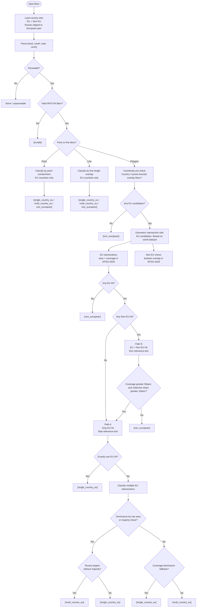

```mermaid
flowchart TD
        A([Input bbox]) --> B["Load country sets<br/>EU + Non-EU<br/>Russia clipped to European part"]
        B --> C["Parse [west, south, east, north]"]
        C --> D{Parseable?}
        D -- No --> N0[None / unparseable]
        D -- Yes --> E{Valid WGS 84 bbox?}

        E -- No --> INVALID["[invalid]"]
        E -- Yes --> F{Point or line bbox?}

        F -- Point --> G["Classify by point containment<br/>EU countries only"]
        F -- Line --> H["Classify by line length overlap<br/>EU countries only"]
        F -- Polygon --> I["Coordinate pre-check<br/>Country 4 points bounds overlap bbox?"]

        G --> R1["[single_country_eu / multi_country_eu / non_european]"]
        H --> R2["[single_country_eu / multi_country_eu / non_european]"]

        I --> J{"Any EU candidates?"}
        J -- No --> NON1["[non_european]"]
        J -- Yes --> K[Geometric intersection with EU candidates. Based on world dataset]

        K --> L["EU intersections:<br/>area + coverage in EPSG:3035"]
        K --> M["Non-EU check:<br/>boolean overlap in EPSG:4326"]

        L --> N{"Any EU hit?"}
        N -- No --> NON2["[non_european]"]
        N -- Yes --> O{Any Non-EU hit?}

        O -- No --> P["Path A<br/>Only EU hit<br/>Skip relevance test"]
        O -- Yes --> Q["Path B<br/>EU + Non-EU hit<br/>Run relevance test"]

        Q --> S{Coverage greater 50perc and collective share greater 10perc?}
        S -- No --> NON3["[non_european]"]
        S -- Yes --> P

        P --> T{Exactly one EU hit?}
        T -- Yes --> SINGLE1["[single_country_eu]"]
        T -- No --> U[Classify multiple EU intersections]

        U --> V{Dominance by raw area<br/>or majority share?}
        V -- Yes --> W{Russia largest<br/>without majority?}
        W -- Yes --> MULTI_RU["[multi_country_eu]"]
        W -- No --> SINGLE2["[single_country_eu]"]

        V -- No --> X{Coverage-dominance fallback?}
        X -- Yes --> SINGLE3["[single_country_eu]"]
        X -- No --> MULTI["[multi_country_eu]"]
```
