# Bbox classifier — pipeline flowchart

A faithful, top-down map of `bbox_classifier.classify_bbox`. Every branch a bbox
can take — parse, validate, degenerate short-circuits (point/line), the EU/non-EU
intersection, the relevance test, and the full Step 5 single/multi ladder — is
shown, so any bbox can be traced from input to its label.

- **Authoritative source:** the module docstring of `bbox_classifier.py` (the
  *mechanism*) and `0001-bbox-classifier-design-choices.md` (the *whys*). This
  chart is a visual companion.
- **Threshold values** in the diagram are the **live values** read from
  `bbox_classifier.py`. A test (`test_flowchart_thresholds_match_code` in
  `test_bbox_classifier.py`) asserts every literal below equals its constant, so
  the chart cannot drift silently — edit the chart freely, and `uv run pytest`
  fails loudly if a number falls behind.

## Terms

- **EU set** — the European *continent* per the source boundaries
  (`continent = "Europe"` AND `status = "Member State"`), plus Turkey and Cyprus
  (included by name). Russia is clipped west of 60°E. **Not** the European Union.
- **degenerate bbox** — a point (both axes collapsed) or a line (exactly one axis
  collapsed); zero-area, so resolved by containment (point) or length (line)
  instead of area.
- **coverage** (of a country) — `intersection area ÷ country total area`. The
  fraction of the *country* that lies inside the bbox. High coverage ⇒ the bbox
  is "about" that country.
- **share** (of a country) — `intersection area ÷ total EU intersection area`. The
  country's fraction of the *EU overlap* in the bbox.
- **meaningful country** — one substantially inside the bbox (coverage meets the
  Step 4 threshold).
- **raw_ratio** — `top hit's area ÷ runner-up's area` (how many times bigger the
  leader is). For lines, intersection length replaces area.
- **top_share** — the top EU hit's share of the EU overlap.
- **coverage_ratio** — `highest coverage ÷ second-highest coverage`.
- **Path A / Path B** — A: only EU countries are hit (no competition, relevance
  test skipped); B: both EU and non-EU countries are hit (relevance test must prove 
  the EU overlap is intentional).

## Outcome colours

🟩 `single_country_eu` · 🟦 `multi_country_eu` · ⬜ `non_european` · 🟥 `invalid`
(unparseable input → `None`). Dashed amber = the Step 0 one-time load, not a
per-bbox step.

```mermaid
---
title: bbox_classifier.classify_bbox — pipeline
---
flowchart TD
    LOAD["Step 0 · RUN ONCE — load country sets<br/>EU = (continent Europe + Member State) ∪ {Turkey, Cyprus}; Russia clipped to [0°, 60°E]<br/>Non-EU = all other countries"]

    IN(["Input bbox string"])
    LOAD --> IN

    IN --> PARSE["Step 1 · Parse '[west, south, east, north]'"]
    PARSE --> D_PARSE{"Parseable?"}
    D_PARSE -- No --> NONE(["None — unparseable"])
    D_PARSE -- Yes --> D_VALID{"Step 1.0 · Valid WGS 84?<br/>west, east within ±180 · south, north within ±90<br/>east ≥ west · north ≥ south<br/>(strict inequalities — degenerate bboxes pass)"}

    D_VALID -- No --> INVALID(["invalid"])
    D_VALID -- Yes --> D_DEGEN{"Degenerate bbox?<br/>both axes collapsed → point<br/>exactly one axis collapsed → line<br/>neither → polygon"}

    %% --- Step 1.5 — point ---
    D_DEGEN -- Point --> POINT["Step 1.5 · Point: containment (covers)<br/>EU set only — non-EU never consulted"]
    POINT --> R_POINT{"EU countries covering the point?"}
    R_POINT -- "0" --> NON_P(["non_european"])
    R_POINT -- "1" --> SIN_P(["single_country_eu"])
    R_POINT -- "2+" --> MUL_P(["multi_country_eu"])

    %% --- Step 1.5 — line ---
    D_DEGEN -- Line --> LINE["Step 1.5 · Line: intersection length, EPSG:3035<br/>EU set only — non-EU never consulted"]
    LINE --> R_LINE{"EU line hits?"}
    R_LINE -- "0" --> NON_L(["non_european"])
    R_LINE -- "1" --> SIN_L(["single_country_eu"])
    R_LINE -- "2+" --> STEP5

    %% --- Step 2 — bounds pre-check (polygon path) ---
    D_DEGEN -- Polygon --> STEP2["Step 2 · Bounds pre-check on EU countries<br/>keep only those whose .bounds overlap the bbox"]
    STEP2 --> D_EUBOUNDS{"Any EU country's bounds overlap?"}
    D_EUBOUNDS -- No --> NON_1(["non_european · no EU bounds overlap"])
    D_EUBOUNDS -- Yes --> STEP3EU["Step 3 · EU geometric intersection<br/>intersect in EPSG:4326 → area + coverage measured in EPSG:3035"]
    STEP3EU --> D_EUHIT{"Any EU overlap?<br/>(intersection area > 0)"}
    D_EUHIT -- No --> NON_2(["non_european · bounds overlapped, geometry empty"])
    D_EUHIT -- Yes -->     STEP3NON["Step 3 · Non-EU boolean check<br/>bounds pre-check + overlap in EPSG:4326 · stops at the first hit (break)"]
    STEP3NON --> D_NONEU{"Any non-EU country also overlapped?"}

    %% --- Path A vs Path B ---
    subgraph SG_PATHA ["Path A — EU only"]
        PATHA["No competition — relevance test skipped"]
    end
    subgraph SG_PATHB ["Path B — EU + non-EU"]
        D_REL{"Step 4 · Relevance test passes?<br/>≥ 1 meaningful country (coverage ≥ 50%)<br/>AND collective share ≥ 10% of EU overlap"}
        NON_3(["non_european · relevance test failed"])
        D_REL -- No --> NON_3
    end

    D_NONEU -- No --> SG_PATHA
    D_NONEU -- Yes ---> SG_PATHB
    PATHA --> D_ONE
    D_REL -- Yes --> D_ONE

    D_ONE{"Exactly one EU hit?"}
    D_ONE -- Yes --> SIN_ONE(["single_country_eu"])
    D_ONE -- No --> STEP5["Step 5 · Classify 2+ EU intersections<br/>(shared entry — polygon or line)"]

    %% --- Step 5 ladder (reached by polygon 2+ and line 2+) ---
    STEP5 --> RU{"Russia is the top EU hit<br/>but holds < 50% of EU overlap?<br/>(Russia is huge — wins pan-EU bboxes by raw area<br/>even when it is not the subject)"}
    RU -- Yes --> MUL_RU(["multi_country_eu · Russia pan-European override"])
    RU -- No --> DOM{"One country dominates the EU overlap?<br/>raw_ratio > 2 (beats runner-up by area)<br/>OR (polygon only) top_share ≥ 50% (majority of EU overlap)"}
    DOM -- Yes --> SIN_DOM(["single_country_eu"])
    DOM -- No --> POLY{"Polygon?<br/>(lines stop here — no majority / coverage gates)"}
    POLY -- "No (line)" --> MUL_LINE(["multi_country_eu · no coverage fallback for lines"])
    POLY -- Yes --> COV{"Coverage-dominance fallback passes?<br/>coverage_ratio > 1.5 (catches a small country wholly inside,<br/>while its larger neighbours are only clipped)<br/>AND that country's share > 10% of EU overlap"}
    COV -- Yes --> SIN_COV(["single_country_eu · coverage-dominance fallback"])
    COV -- No --> MUL(["multi_country_eu"])

    %% --- styling ---
    classDef oneshot fill:#fff3cd,stroke:#b8860b,stroke-width:2px,stroke-dasharray:5 5,color:#000
    classDef single  fill:#d4edda,stroke:#28a745,stroke-width:2px,color:#000
    classDef multi   fill:#d1ecf1,stroke:#117a8b,stroke-width:2px,color:#000
    classDef noneur  fill:#e9ecef,stroke:#6c757d,stroke-width:2px,color:#000
    classDef invalid fill:#f8d7da,stroke:#dc3545,stroke-width:2px,color:#000

    class LOAD oneshot
    class NONE,INVALID invalid
    class NON_P,NON_L,NON_1,NON_2,NON_3 noneur
    class SIN_P,SIN_L,SIN_ONE,SIN_DOM,SIN_COV single
    class MUL_P,MUL_RU,MUL_LINE,MUL multi
```

