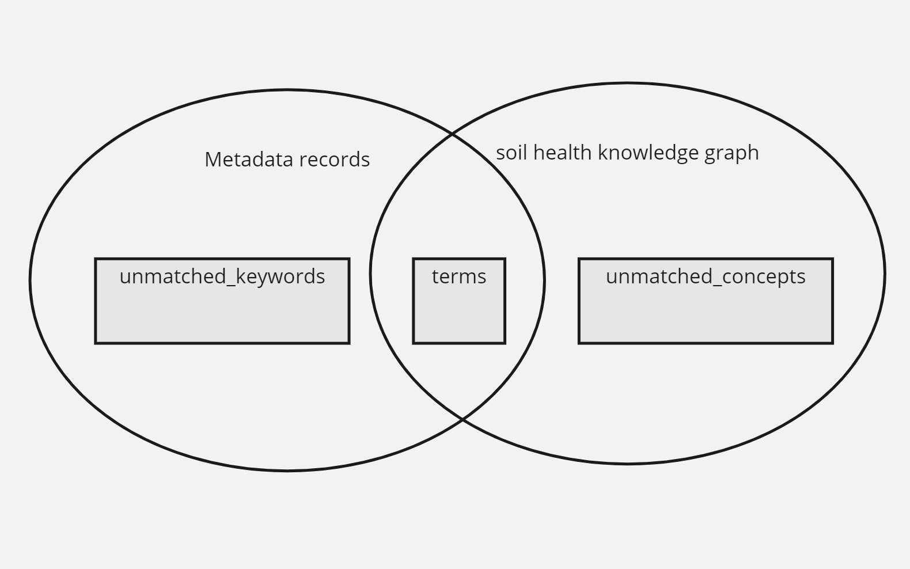

## Keyword Matcher

Analyses existing keywords on a metadata record, it matches an existing keyword to a list of predefined keywords, augmenting the keyword to include a thesaurus and uri reference (potentially a translation to english)

It requires a database with common thesauri

A match is made by label, or aliases (sameAs, closeMatch), may require translation.

## For Users

Users can help validate and improve the keyword-matcher by checking/editing matched and unmatched terms. Three csv files are relevant: [terms.csv](./result/terms.csv), [unmatched_keywords.csv](./result/unmatched_keywords.csv), and [unmatched_concepts.csv](./result/unmatched_concepts.csv), referring to the terms that successfully find a match, keywords from the metadata records failed to find a match, concepts from the knowledge graph didn't find a match respectivaly, as shown in the picture below:



### [terms.csv](./result/terms.csv)
It shows the terms that already matched (~ 160 terms). There are four fields:

- identifier: the identifier of the term from the soil health knowledge graph. It is currently non-resolvable, means that the url does not lead to any resource.
- label: the english label of the term.
- uri: an uri from AgroVoc or ISO11074, which is resolable. Users can use this link to find information of this term.
- class: the category of the term, initially defined by developers.
  
This file is used by the SWR to serve the filtering functionality of the catalogue. For example, there is a class 'soil threats' with terms of 'soil pollution' and 'soil erosion'. In the catalogue there will be a fiter element 'soil threats' and sub-filter elements 'soil poluttion' and 'soil erosion'. By clicking on the sub-filter element, relevant records can be selected and displayed.

Users can check:
1. Are these terms necessary for the filtering? For example, terms like 'soil' are broad terms and not supposed to be included in the filter.
2. Are the classes of terms makes sense?

### [unmatched_keywords.csv](./result/unmatched_keywords.csv)
It shows the keywords from the metadata records that not yet find a match from the knowledge graph. (~10,000 terms)

- Label: label of the keywords
- Count: count of records that has the keyword

Users can check the frequent keywords (e.g, top 100) and determine which keywords should be added to the matching source. Details to be find in this [issue](https://github.com/soilwise-he/metadata-augmentation/issues/22).

### [unmatched_concepts.csv](./result/unmatched_concepts.csv)
It shows the concepts from the knowledge graph that not finding a match with the metadata record keywords. 

### [vague_match.csv](./result/vague_match.csv)
When matching the terms, we use fuzzy match to allow some slight difference between keywords and concepts. The fuzz score between two strings means the similarity between two string. If the score >= threshould (80), we apply the match. In this file, we list the matching pair with the score between 80 and 100 to check the False Positives. Users can check the errors in these pairs. For example, 'Soil Pollutants' is matched with 'Soil Pollutions' with a score of 83, that is an error. Details can be found in this [issue](https://github.com/soilwise-he/metadata-augmentation/issues/23)


<!-- ## Development status

- Initial development as part of [harvest module](https://github.com/soilwise-he/harvesters/blob/main/utils/keyword_matching.py), a keyword is validated against a know list of keywords, if a match is available a URI of the keyword is returned

- In next iteration, the keywords can be populated from a sparql query: `select skos:concept where skos:prefLabel[@lang=='{language}']=={keyword}`, it means we should prepare a triple store with selected taxonomies (glosis, agrovoc, gemet, inspire, ...). To verify if [soilhealth knowledge graph](https://github.com/soilwise-he/soil-health-knowledge-graph) is a good location for this. -->

## For Catalogue Developers

The keyword-matcher is triggered by running the script [match2keytemp.py](match2keytemp.py).

Full process:

```shell
python3 ./keyword-matcher/match2keytemp.py

```

Batch process:

```shell
python3 ./keyword-matcher/match2keytemp.py -b True

```

The full process runs on all records from the database, and the batch process runs only on new-added records that have not been process by the keyword-matcher.


