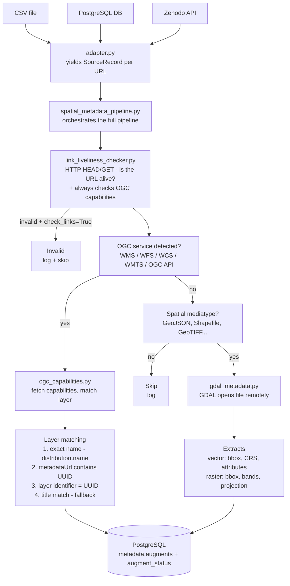

# Spatial Metadata Extraction Pipeline

Validates URLs from a metadata catalogue and extracts spatial metadata from OGC services and downloadable spatial files, storing results in PostgreSQL.

---

## Components

| File | Purpose |
|------|---------|
| `adapter.py` | Reads records from PostgreSQL, CSV, or Zenodo and yields standardised `SourceRecord` objects |
| `link_liveliness_checker.py` | Checks if a URL is alive and detects OGC service type |
| `ogc_capabilities.py` | Fetches OGC capabilities (WMS/WFS/WCS/WMTS/OGC API) and matches the correct layer |
| `gdal_metadata.py` | Opens spatial files (GeoTIFF, Shapefile, GeoPackage, etc.) via GDAL and extracts structural metadata |
| `spatial_metadata_pipeline.py` | Orchestrates the full pipeline — reads records, validates URLs, dispatches to OGC or GDAL, writes to DB |

---

## Component Diagram



---

## How It Works

**Input** — a record from the catalogue has:
- `identifier` — the record UUID
- `url` — link to an OGC service or downloadable file
- `lname` — layer name hint from `distribution.name`
- `mediatype` — optional hint about file type

**For each record the pipeline:**

1. Checks if the URL is alive (HTTP HEAD/GET) — skipped if `--no-link-check` is set
2. **Always checks for OGC capabilities first** (WMS/WFS/WCS/WMTS/OGC API), regardless of `--no-link-check`
   - If OGC capabilities found → fetches layer metadata and writes to DB, GDAL is skipped entirely
   - If URL is invalid and `--no-link-check` is not set → logs as invalid and skips
3. If no OGC capabilities → checks if mediatype is spatial (GeoTIFF, Shapefile, ZIP, etc.) → opens with GDAL
4. Writes metadata to `metadata.augments` and status to `metadata.augment_status`

**OGC layer matching** tries four methods:
1. Exact name match against `distribution.name`
2. Layer's `metadataUrl` contains the record UUID
3. Layer's `identifier` matches the record UUID
4. Layer title matches `distribution.name` (fallback)

---

## Output

Results are written to PostgreSQL:

```
metadata.augments       — one row per metadata property (bbox, crs, title, etc.)
metadata.augment_status — one row per record with status (success, invalid, skipped, etc.)
```

Optional JSONL output per record:

```json
{
  "identifier": "f1fead83-2962-46e9-806d-5ea55692ea13",
  "url": "https://geo.example.com/wms",
  "metadata": {
    "service_type": "wms",
    "layer_name": "bodemhoogte_1mtr",
    "title": "Bodemhoogte 1mtr",
    "bbox": [3.2, 50.7, 7.2, 53.6],
    "crs4326": true
  },
  "date": "2025-05-13T10:00:00Z",
  "process": "spatial-extractor",
  "error": null
}
```

---

## Usage

```bash
# From PostgreSQL catalogue
python spatial_metadata_processor.py --source postgresql

# From CSV file
python spatial_metadata_processor.py --source csv --csv-file records.csv

# From Zenodo
python spatial_metadata_processor.py --source zenodo --zenodo-query "soil moisture"

# With options
python spatial_metadata_processor.py --source csv --csv-file records.csv \
  --output results.jsonl \
  --limit 100 \
  --no-link-check
```

### Arguments

| Argument | Description | Default |
|----------|-------------|---------|
| `--source` | Record source: `postgresql`, `csv`, `zenodo` | `postgresql` |
| `--csv-file` | Path to CSV file (required when `--source=csv`) | — |
| `--zenodo-query` | Search query (required when `--source=zenodo`) | — |
| `--zenodo-community` | Zenodo community slug | — |
| `--zenodo-token` | Zenodo access token for restricted records | — |
| `--zenodo-max` | Max deposits to fetch (0 = no limit) | `0` |
| `--output` | Output JSONL file path | — |
| `--limit` | Max records to process | — |
| `--no-link-check` | Skip URL validation | `False` |

---

## Dependencies

```bash
pip install gdal aiohttp owslib psycopg2 requests
```