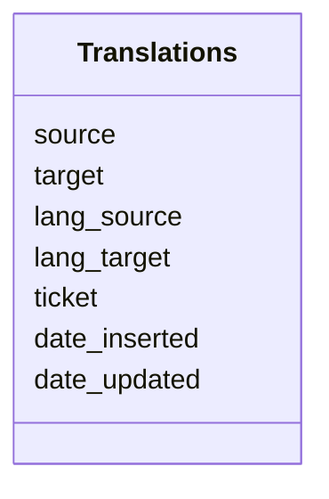

## Translation module

Many records arrive in a local language, we aim to capture at least main properties for the record in english: title, abstract, keywords, lineage, usage constraints

- has a db backend, every translation is captured in a database
- the EU translation service is used, this service returns a asynchronous response to an API endpoint (callback)
- the callback populates the database, next time the translation is available
- make sure that frontend indicates if a string has been machine translated, with option to flag as inappropriate

API documentation <https://language-tools.ec.europa.eu/>

A token for the service is available, ask Nick, RobK or Paul if you need it.

## Error codes

Error codes start with -, following error codes are of interest

| code   | description |
| ---    | --- | 
| -20001 | Invalid source language | 
| -20003 | Invalid target language(s) | 
| -20021 | Text to translate too long | 
| -20028 | Concurrency quota exceeded | 
| -20029 | Document format not supported | 

